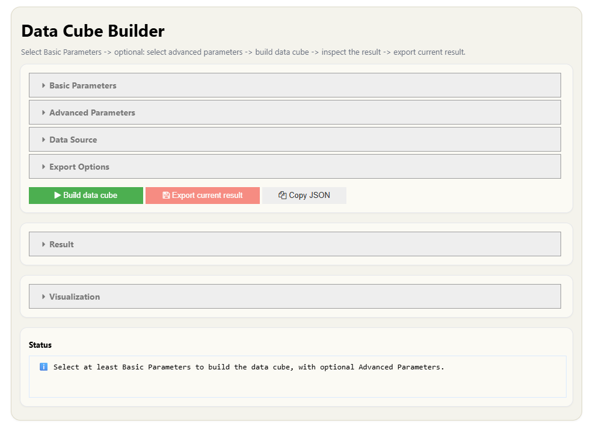

# stac2cube   STACs to Analysis-Ready Data Cubes

-   If you use **stac2cube** in your research, you are kindly asked to cite it. Thank you!   See: [Citation](#citation)
-   Free software: Apache 2.0
-   This software is designed to function on any local-machine and also HPC system using SLURM jobs.

## Table of Contents
- [Feature Overview](#feature-overview)
- [Installation](#installation)
- [How to run](#how-to-run)
- [How to run on HPC](#how-to-run-on-hpc)
- [Access and Licensing Details for STAC Catalogs](#access-and-licensing-details-for-stac-catalogs)
- [Method References](#method-references)
- [Citation](#citation)

## Feature Overview
**stac2cube** converts SpatioTemporal Asset Catalogs (STAC) into Analysis-Ready Data (ARD) cubes for efficient Earth Observation (EO) processing.

For Sentinel-2, the ARD cubes are built with three main components:

-   **Cloud masking** based on user-defined thresholds. This lets users control how strict cloud detection should be and export multiple cloud-masked cubes. Traditional options like filtering by max_cc (STAC metadata) and masking with the Scene Classification Layer (SCL) are also supported for faster processing.

    -   **Cloud shadow masking**  following the [Google Earth Engine s2cloudless tutorial](https://developers.google.com/earth-engine/tutorials/community/sentinel-2-s2cloudless): clouds are projected along the anti-solar direction using the per-scene mean solar azimuth from the STAC metadata, and dark non-water NIR pixels inside that projection are flagged as shadow. Returns cloud, shadow and combined masks on the exact cube grid, with optional masking of the cube.

-   **Co-registration** to reduce scene-to-scene X/Y misalignment (often around 1-2 pixels). Small sub-pixel shifts (below 10 m) can still remain.

-   **Super-resolution** of both 10-meters and 20-meters bands to 2.5 meters. Another option is 20-meters bands super-resolution to 10-meter.

The result is a data cube that is cloud-masked with customizable thresholds, spatially aligned across time, and available at higher spatial resolution. Details about the underlying algorithms and how to cite the used third-party tools can be found in the [Examples](#examples) section.

### Below is an example of 2 animations showing before and after ARD cube generation.

  <h2>Before (Initial Data Cube)</h2>
  

 

  <h2>After (Co-registered and Super Resolved Data Cube)</h2>
  

  

## Installation
Installation is possible with package managers like [Micromamba](https://mamba.readthedocs.io/en/latest/installation/micromamba-installation.html) & [Anaconda](https://www.anaconda.com/docs/getting-started/anaconda/install). 

#### Step 1: Clone the repository to your current working directory

    git clone https://github.com/BaturalpArisoy/stac2cube.git

If git is not available for you, download and unzip the file: https://github.com/BaturalpArisoy/stac2cube/archive/refs/heads/main.zip

#### Step 2: Change directory to cloned stac2cube folder

    cd "path/to/stac2cube/"

*environment.yml* file should be present in this path, please double check.

#### Step 3: Install stac2cube via Micromamba or Anaconda Prompt (this might take a while!)

##### a) LINUX

    micromamba env create -n stac2cube -f environment.yml

##### b1) WINDOWS Micromamba

    micromamba env create -n stac2cube -f environment.yml; micromamba install -n stac2cube -c conda-forge vs2015_runtime

##### b2) WINDOWS Anaconda Prompt

    conda env create -n stac2cube -f environment.yml && conda activate stac2cube && conda install -c conda-forge vs2015_runtime

---

### Optional: GPU (CUDA) acceleration for super-resolution (Windows only)

**Linux users (including HPC systems such as terrabyte) can skip this section** - the installation above already comes with a CUDA-enabled PyTorch, and super-resolution automatically uses an NVIDIA GPU if one is present.

This step is only needed on **Windows**, where the default PyTorch is CPU-only: super-resolution runs on the CPU (it works, just slowly) until you swap in the CUDA build below. Once installed, the code detects and uses the GPU automatically.

First, check that you have a CUDA-capable NVIDIA GPU:

    nvidia-smi

If it prints a table showing your NVIDIA GPU and a CUDA version of 12.x, you are ready to continue. If the command is not found, you do not have an NVIDIA GPU or driver, so stay on the CPU build.

Then replace the CPU PyTorch in the `stac2cube` environment with the matching CUDA build:

<!-- Maintainers: keep the +cu121 suffix on both versions. A bare torch==2.2.2 is treated by
     pip as already satisfied by the installed 2.2.2+cpu build and silently skipped, leaving
     the user on CPU. The +cu121 pin forces the CUDA wheels to replace the CPU ones. -->

##### Micromamba

    micromamba run -n stac2cube pip install torch==2.2.2+cu121 torchvision==0.17.2+cu121 --index-url https://download.pytorch.org/whl/cu121

##### Anaconda Prompt

    conda run -n stac2cube pip install torch==2.2.2+cu121 torchvision==0.17.2+cu121 --index-url https://download.pytorch.org/whl/cu121

Verify that the GPU is detected:

    micromamba run -n stac2cube python -c "import torch; print(torch.__version__, '| CUDA available:', torch.cuda.is_available())"

It should print a build ending in `+cu121` and `CUDA available: True`.

**Notes**
- The CUDA build downloads ~2.4 GB of GPU libraries, which is why it is not installed by default.
- The same build also runs on machines without a GPU (it falls back to the CPU), so it is safe to use in a shared environment.

---

## How to run
### Interactive User Interface on Jupyter Notebook (recommended):
The **recommended** way to run stac2cube is through the interactive GUI tools in the [User Interface Tools](https://github.com/BaturalpArisoy/stac2cube/tree/main/interactive/User_Interface_Tools.ipynb) notebook. It bundles the full workflow in one place, requires no manual coding.   Just set the parameters and enjoy your coffee while your data cube is being built :)  

1) Data Cube Builder (see example below)
2) Data Cube Editor
3) Analysis Ready Data Cube Tools (Probabilistic Cloud Masking, Co-registration and Super-resolution)  

### Step-by-step Interactive Notebooks
For a more detailed walkthrough of stac2cube features, including background, processing steps, and storage, see the well-documented notebooks in the [tutorials folder](https://github.com/BaturalpArisoy/stac2cube/tree/main/interactive/tutorials).

Each step is documented by the numbers and the general explanation is given below:

1. **Initial Data Cube**
    - Collects images from STAC catalogs for the selected mission based on users parameters.
    - Generates multi-dimensional data cubes, suitable for time-series.
    - The data cubes can be **updated** anytime without generating them from the scratch.
    - Available missions: **Sentinel-2 L2A, Sentinel-2 L1C, Sentinel-1 RTC, Landsat C2 L2, COP DEM Glo-30 (single time)**
2. **Cloud Mask Data Cube**
    - The result contains cloud probability maps and user defined binary cloud mask layers of time-series.
    - When selected, clouds from the initial data cube are automatically masked out.
    - Can be updated anytime.
3. **Co-register Data Cube**
    - Fix the global X/Y shift between consecutive Sentinel-2 items.
    - IMPORTANT: Please read notes in the notebook for better quality results.
4. **Super-resolve Data Cube**
    - Super resolves both 10-meters and 20-meters bands to 2.5-meters. ["blue", "green", "red", "nir", "nir08", "rededge1", "rededge2", "rededge3", "swir16", "swir22"] for the entire Sentinel-2 data cube time-series.

## How to run on HPC
A documentation file on how to use stac2cube features on terrabyte's HPC for compute-intensive processes and for faster processing time can be found in the [slurm folder](https://github.com/BaturalpArisoy/stac2cube/tree/main/slurm). Reading step by step is actually pretty simple.

## Access and Licensing Details for STAC Catalogs

### Access to STAC Catalogs

- **Important**: _terrabyte_ STAC catalogs can be only computed when working on a _terrabyte_ environment. 
- However, stac2cube package is designed to work on both local-machine without _terrabyte_ connection and within _terrabyte_ HPC environment. 
- The user can select the desired STAC source (also in user interface). 
- Note that stac2cube package **can not** guarantee unlimited access to these open-access data catalogs in the future!

### STAC Catalog Licenses

| Provider   | Service           | STAC API                                        | License                                                                                      | Open-Access | Requires Credentials |
|------------|-------------------|-------------------------------------------------|----------------------------------------------------------------------------------------------|-------------|----------------------|
| DLR        | terrabyte         | https://stac.terrabyte.lrz.de/public/api/       | MIT License Copyright (c) 2024 Deutsches Zentrum für Luft- und Raumfahrt e.V.                | No          | Yes                  |
| Element 84 | Earth Search      | https://earth-search.aws.element84.com/v1/      | Apache License 2.0                                                                           | Yes         | No                   |
| Microsoft  | Planetary Computer| https://planetarycomputer.microsoft.com/api/stac/v1    | MIT License Copyright (c) Microsoft Corporation.                                             | Yes         | No                   |
| ESA        | Copernicus Data Space Ecosystem | https://stac.dataspace.copernicus.eu/v1               | Copernicus data - free, full and open access (Legal notice on the use of Copernicus data)   | Yes         | Yes                  |

## Method References

1. **Cloud Mask Data Cube** applies **[s2cloudless](https://github.com/sentinel-hub/sentinel2-cloud-detector)** by Sentinel Hub - CC-BY-SA-4.0 license.
2. **Co-register Data Cube** applies **[AROSICS](https://github.com/GFZ/arosics)** by Daniel Scheffler - Apache-2.0 license.
    
    Daniel Scheffler. (2017, July 3). AROSICS: An Automated and Robust Open-Source Image Co-Registration Software for Multi-Sensor Satellite Data (Version 0.12.1). Zenodo. https://doi.org/10.5281/zenodo.3742909
    
3. **Super-resolve Data Cube** applies **[SEN2SR](https://github.com/ESAOpenSR/SEN2SR)** by Aybar et al. - CC0-1.0 license.

    Aybar, C., Contreras, J., Donike, S., Portalés-Julià, E., Mateo-García, G., & Gómez-Chova, L. (2026). A radiometrically and spatially consistent super-resolution framework for Sentinel-2. Remote Sensing of Environment, 334, 115222. https://doi.org/10.1016/j.rse.2025.115222
    

## Citation

### Method paper

    Arisoy, B., Betz, F., Stauch, G., Klein, D., Dech, S., and Ullmann, T.: Scalable Earth Observation Data Cubes for Advanced Analytics of Dynamic Earth Surface Processes: An Open-Source Package for Customized Processing of Sentinel-2 Data on HPCs and Beyond, EGUsphere [preprint], https://doi.org/10.5194/egusphere-2026-619, 2026.

### Software
**Please include the exact version**

    Arisoy, B., Betz, F., Stauch, G., Klein, D., Dech, S., & Ullmann, T. (2025). stac2cube (Version 1.4.0). Zenodo. https://zenodo.org/records/18495808

## Contact 
https://www.geographie.uni-wuerzburg.de/en/earthobservation/staff/baturalp-arisoy/